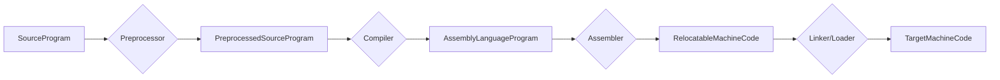
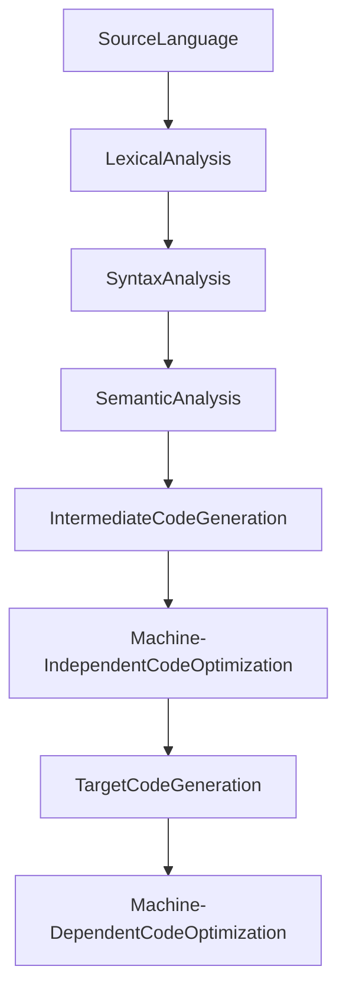

# compiler-from-scratch

English &nbsp; | &nbsp; [Chinese](./README.zh-CN.md)

## Prerequisite Knowledge

Basic Concepts:

- Translation: The process of converting the source program of one language into another language program **without changing its semantics**.
- Assembly: The process of translating assembly language into machine language.
- Compilation: The process of translating high-level language into assembly language or machine language.
- Interpretation: The process of interpreting and executing the source program code line by line.

Compilation Stages:

> Syntax-Directed Translation

## Implementation
