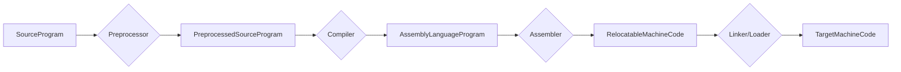
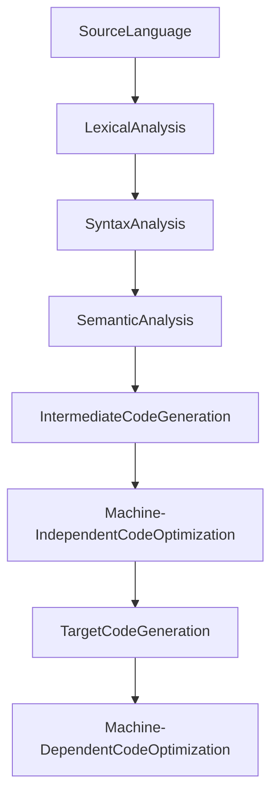

# compiler-from-scratch

English &nbsp; | &nbsp; [Chinese](./README.zh-CN.md)

## Prerequisite Knowledge

Basic Concepts:

- Translation: The process of converting the source program of one language into another language program **without changing its semantics**.
- Assembly: The process of translating assembly language into machine language.
- Compilation: The process of translating high-level language into assembly language or machine language.
- Interpretation: The process of interpreting and executing the source program code line by line.

Compilation Stages:

> Syntax-Directed Translation

### Lexical Analysis

> Lexical Analyzer (or Scanner): Scans the characters of the source code line by line from left to right, converting recognized words into a series of tokens (i.e., lexical units).

Types of lexical units:

- `Program`
- `VariableDeclaration`
- `VariableDeclarator`
- `Identifier`
- `Literal`
- `UnaryExpression`
- `BinaryExpression`

### Syntax Analysis

> Syntax Analyzer: Organizes the sequence of tokens generated by the lexical analyzer into a tree structure, commonly referred to as an Abstract Syntax Tree (AST).

### Semantic Analysis

> Semantic Analyzer: Checks the semantic correctness of the program, ensuring that the program is logically sound. Semantic analysis typically involves type checking, scope resolution, symbol table management, etc.

### Intermediate Code Generation

> Intermediate Code Generator: Responsible for converting the abstract syntax tree generated by the syntax analysis into intermediate code. Intermediate code is a representation that lies between source code and target code, usually platform-independent, facilitating subsequent optimization and target code generation.

Common representations of intermediate code:

- Three-address code
- Syntax structure tree

### Target Code Generation

> Target Code Generation: Responsible for converting intermediate code (such as three-address instructions) into machine code or assembly code specific to a particular platform.

### Code Optimization

> Code Optimization: Improves the execution efficiency of the generated code and reduces resource consumption. Optimization can occur at multiple levels, including source code level, intermediate code level, and target code level, with the goal of generating faster, smaller, or more efficient code while maintaining the semantics of the program.

Common optimization techniques:

- **Constant Folding**: Computing the value of constant expressions at compile time.
- **Common Subexpression Elimination**: Avoiding the repeated computation of the same expression.
- **Dead Code Elimination**: Removing code that will not be executed.
- **Loop Invariant Code Motion**: Moving computations that do not change within a loop outside of the loop.
- **Register Allocation Optimization**: Optimizing the allocation of variables between registers and memory to reduce memory access.

## Implementation
