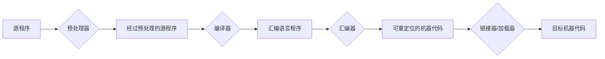
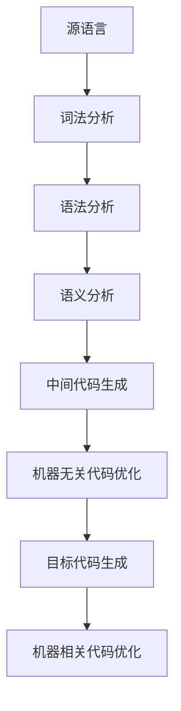

# 从零开始制作编译器

[英文](./README.md) &nbsp; | &nbsp; 简体中文

## 前置知识

基本概念:

- 翻译: 将某种语言的源程序，在**不改变语义**的条件下，转换为另一种语言程序的过程
- 汇编：将汇编语言翻译成机器语言的过程
- 编译：将高级语言翻译成汇编语言或机器语言的过程
- 解释: 将源程序代码一行一行地解释并执行

编译阶段:

> 语法制导翻译

## 实现

