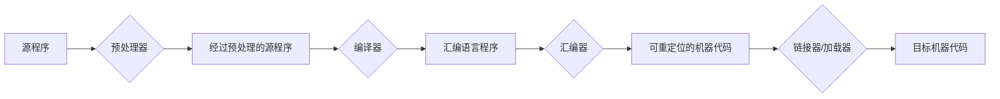
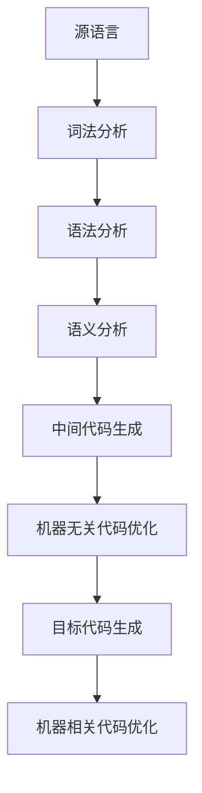

# 从零开始制作编译器

[英文](./README.md) &nbsp; | &nbsp; 简体中文

## 前置知识

基本概念:

- 翻译: 将某种语言的源程序，在**不改变语义**的条件下，转换为另一种语言程序的过程
- 汇编：将汇编语言翻译成机器语言的过程
- 编译：将高级语言翻译成汇编语言或机器语言的过程
- 解释: 将源程序代码一行一行地解释并执行

编译阶段:

> 语法制导翻译

### 词法分析

> 词法分析器(或扫描器): 从左向右逐行扫描源代码的字符，将识别的单词转换为一系列的记号（即词法单元token）

词法单元的类型:

- `Program`
- `VariableDeclaration`
- `VariableDeclarator`
- `Identifier`
- `Literal`
- `UnaryExpression`
- `BinaryExpression`

### 语法分析

> 语法分析器: 根据语言的语法规则，将词法分析器生成的记号序列组织成一个树形结构，通常称为抽象语法树（Abstract Syntax Tree, AST）

### 语义分析

> 语义分析器: 检查程序的语义正确性，确保程序在逻辑上是合理的。语义分析通常涉及类型检查、作用域解析、符号表管理等

### 中间代码生成

> 中间代码生成器：负责将语法分析生成的抽象语法树转换为中间代码。中间代码是一种介于源代码和目标代码之间的表示形式，通常是平台无关的，便于后续的优化和目标代码生成

常用的中间代码表示形式:

- 三地址码
- 语法结构树

### 目标代码生成

> 目标代码生成: 负责将中间代码（如三地址指令）转换为特定平台的机器代码或汇编代码

### 代码优化

> 代码优化: 提高生成代码的执行效率和减少资源消耗。优化可以在多个层面进行，包括源代码级别、中间代码级别和目标代码级别，目标是生成更快、更小或更高效的代码，同时保持程序的语义不变

常见的优化技术:

- **常量折叠**：在编译时计算常量表达式的值
- **公共子表达式消除**：避免重复计算相同的表达式
- **死代码消除**：移除不会被执行的代码
- **循环不变代码外提**：将循环中不变的计算移到循环外部
- **寄存器分配优化**：优化变量在寄存器和内存之间的分配，以减少内存访问

## 实现

